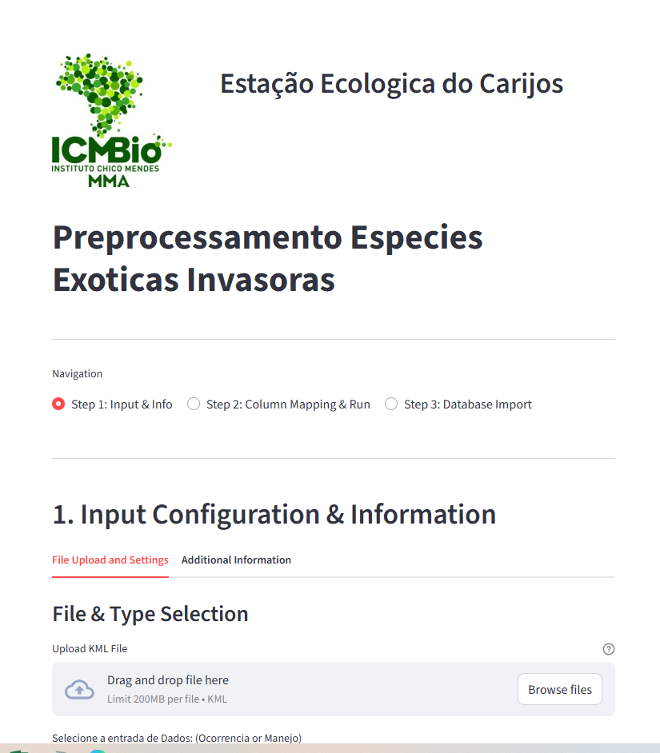

# Manejo Exoticas Invasoras

Coleta de Dados de Campo e Gerenciamento de Banco de Dados

Este repositorio é voltado para a integração da coleta dos dados de campo com o banco de dados geospatial facilitando a integração para analises e relatorios de campo.




### Divisao do repositorio

Existe 3 grandes componentes presente neste projeto:
- Avenza Layer:
  - Layer in .kml a ser importado no Avenza para padronizar a coleta de dados
- App
  - Streamlit app para facilitar a padronização e importação dos dados no banco de dados. Contem UI para usuarios finais.
- pre-processing
  - python development para rodar em bash ou do terminal de comando.
  
### Getting started 

### tree

```bash
├── README.md
├── app2 ## Streamlit app para Gerenciamento dos dados de campo
│   ├── app.py
├── avenza_config ## Default layer file for Avenza 
│   ├── manejo.kml
│   └── ocorrencia.kml
├── database ## Arquivo para criar a database a postgreSQL db.
│   └── create_db.sql
├── main.py
├── pre-processing ## scripts to ETL operations.
├── pyproject.toml ## Python env config
└── uv.lock 
```

## 1. Certifique-se que voce tem:
- [Postgres](https://www.postgresql.org/download/) - instalado em seu computador. Database. 
- [pgadmin4](https://www.pgadmin.org/download/pgadmin-4-windows/) - instalado. Gerenciador da Database
- [`uv`](https://docs.astral.sh/uv/getting-started/installation/) - gerenciador the ambientes em python

## 2. Configure a database em postgreSQL

1. Siga as instruções do ppgadmin4 quando abrir o programam, voce precisa acessar o server PostgreSQL 17 
onde pgadmin4 encontra automaticamente. Depois ele vai pedir para configurar o hostname. Use como hostname: `postgres`,
e senha decida a senha que quiser, lembre-se de guardar.

2. Depois de um login com sucesso, cria uma database e chame de "manejo". 
3. Abre o sql script e execute o arquivo create_db.sql

Dessa forma a database com estará criada. 

## 3. Abra o Gerenciador de Dados de Campo

1. Abra o vscode no projeto. 
2. Abra o terminal de comando
3. verifique os arquivos existente na pasta atual:
```bash
ls 
```
4. Crie um novo ambiente virtual para o python com uv
```
uv venv
```
5 . Sincronize as bibliotecas
```
uv sync
```
Detalhe: passo 4 e passo 5 só é necessario na primeira vez.
Para quando voce já tem o venv existe, pule direto para o item 6.

6 . Ative o ambiente
```
source .venv/bin/activate
```

7. Run the app
```
streamlit run app.py
```


### Pre-processing

Run the python files with the following commands

## 1. Data processing and cleaning for the raw .kml from Avenza.

With the active environment, run the following
```
python preprocess.py --type manejo --file Manejo1.kml 
```

## Run the db_importer.py
```
python db_importer.py --type ocorrencia --file_name output/processed_data/ocurrencia12_ps.gpkg 
```